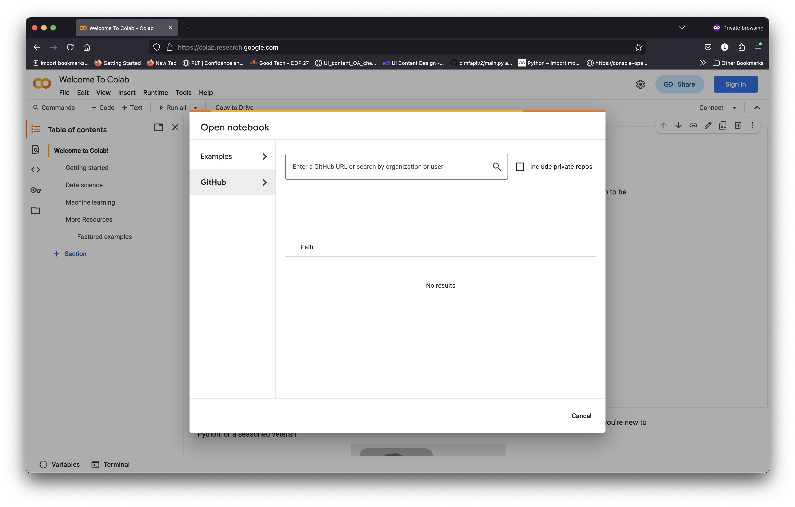

# ML4EO-workshop-2025
A hands-on workshop on using Prithvi-EO-2.0 and Terramind, prepared for the [Machine Learning for Earth Observation conference, 2025](https://ml4eo.org/). There are two notebooks focused on using Geospatial AI Foundation models:

- [Prithvi-EO-2.0 (HLS)](/Prithvi-EO/)
    - Multi-temporal Data (Crop segmentation)
- [Terramind](/TerraMind/)
    - Multi-modal Disaster response using S1, S2

Each notebook can be run in a Jupyter Notebook environment, preferable with access to GPUs.

# Prerequisites
1. Python
1. Machine Learning knowledge
1. Some understanding of Geo-spatial datasets.

# Getting started
This workshop will make use of [Colab](https://colab.google/) as a hosted Jupyter Notebook service. You must be logged in with a Google Account to use the service. Complete the following steps to get started!
1. Navigate to [Google CoLab](https://colab.research.google.com/).
1. Select File > Open Notebook
1. Select `GitHub` and enter `https://github.com/IBM/ML4EO-workshop-2025` into the search box. Select one of the two Notebooks to start working.
1. Optionally authorize GitHub to be used with CoLab. This will enable changes to be saved in GitHub but is not necessary to complete the Workshop.
1. Select Additional connection options > Change runtime type > Select T4 GPU > Save. 

1. Your ready to go! To run a cell, select it, then either click the grey run triangle or hit ⌘/Ctrl+Enter.
